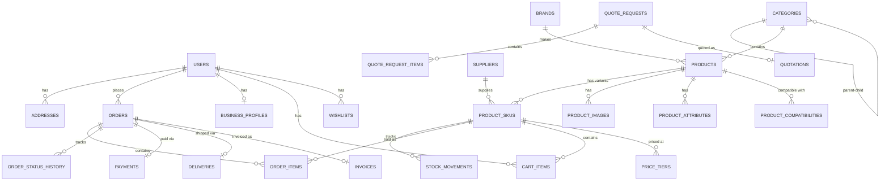

# Shreeji Infotech — Ecommerce Platform Architecture & Phase 1 Plan

Build a production-grade B2B/B2C ecommerce system for Shreeji Infotech (Maninagar, Ahmedabad) selling RAM, SSDs, cables, connectors, networking, and industrial components. Features Ahmedabad Express delivery (30-90 min), technical product specs, B2B tiered pricing, and a unified API backend.

## Deployment Topology

```
┌─────────────────────────────────────────────────────────────┐
│  shreejiinfo.in (Firebase Hosting — existing corporate site) │
│  └─ Static HTML/CSS/JS — untouched                          │
└─────────────────────────────────────────────────────────────┘

┌─────────────────────────────────────────────────────────────┐
│  shop.shreejiinfo.in (VPS + CDN)                            │
│  ┌──────────┐   ┌──────────────┐   ┌──────────────────┐    │
│  │ Next.js  │──▶│ Laravel API  │──▶│ MySQL + Redis    │    │
│  │ Frontend │   │ (api.shreeji │   │ Meilisearch      │    │
│  │ (SSR)    │   │  info.in)    │   │ Cloudflare R2    │    │
│  └──────────┘   └──────────────┘   └──────────────────┘    │
│                  ┌──────────────┐                           │
│                  │ Filament     │                           │
│                  │ Admin Panel  │                           │
│                  │ admin.shreeji│                           │
│                  │  info.in     │                           │
│                  └──────────────┘                           │
└─────────────────────────────────────────────────────────────┘
```

**Domains:**
- `shreejiinfo.in` — existing corporate site (Firebase Hosting, untouched)
- `shop.shreejiinfo.in` — Next.js storefront (SSR for SEO)
- `api.shreejiinfo.in` — Laravel API
- `admin.shreejiinfo.in` — Filament admin panel

---

## User Review Required

> [!IMPORTANT]
> **Breaking change**: The current static HTML store at `shreejiinfo.in/store/` will be **retired**. The corporate site's "Shop" link will redirect to `shop.shreejiinfo.in`. The `store/` directory and its files (`products-data.js`, `store.js`, `store.css`, cart/checkout/compare/wishlist HTML) will no longer be used.

> [!WARNING]
> **Infrastructure cost**: This architecture requires a VPS (₹1,500-3,000/mo for 4GB RAM), MySQL, Redis, Meilisearch. Cloudflare R2 is free up to 10GB. Total estimated hosting: **₹2,000-4,000/month** for Phase 1.

> [!IMPORTANT]
> **Subdomain DNS**: You'll need to create DNS A records for `shop.shreejiinfo.in`, `api.shreejiinfo.in`, and `admin.shreejiinfo.in` pointing to your VPS IP. The corporate site stays on Firebase.

## Open Questions

> [!IMPORTANT]
> 1. **VPS provider preference?** DigitalOcean, Hetzner, AWS Lightsail, or an Indian provider like HostGator/MilesWeb? (Hetzner Ashburn or DigitalOcean Bangalore recommended for latency.)
> 2. **WhatsApp Business API**: Are you using the official WhatsApp Cloud API (Meta Business), or a third-party like Interakt/Wati? This affects notification implementation.
> 3. **GST billing**: Do you want the system to generate PDF GST invoices automatically, or will you generate them from Tally/other accounting software and just link order references?
> 4. **Showroom POS**: How does the showroom currently track inventory? Manual / Tally / spreadsheet? We need to decide how showroom sales decrement stock (Filament quick-sale form vs. POS integration).
> 5. **Product images**: Do you have product images already, or should we use manufacturer stock photos / generate placeholders for launch?

---

## Part 1: Database Schema

### Entity Relationship Diagram



### Table Definitions

#### `users`
| Column | Type | Notes |
|--------|------|-------|
| `id` | `BIGINT PK` | Auto-increment |
| `name` | `VARCHAR(255)` | |
| `email` | `VARCHAR(255) UNIQUE` | |
| `phone` | `VARCHAR(15) UNIQUE` | Indian mobile, primary login |
| `email_verified_at` | `TIMESTAMP NULL` | |
| `phone_verified_at` | `TIMESTAMP NULL` | |
| `password` | `VARCHAR(255)` | |
| `account_type` | `ENUM('personal','business')` | Default: personal |
| `is_active` | `BOOLEAN` | Default: true |
| `remember_token` | `VARCHAR(100)` | |
| `timestamps` | | created_at, updated_at |

---

#### `business_profiles`
| Column | Type | Notes |
|--------|------|-------|
| `id` | `BIGINT PK` | |
| `user_id` | `FK → users` | UNIQUE |
| `company_name` | `VARCHAR(255)` | |
| `gstin` | `VARCHAR(15)` | Validated format |
| `pan` | `VARCHAR(10) NULL` | |
| `billing_address_id` | `FK → addresses NULL` | |
| `credit_limit` | `DECIMAL(12,2)` | Default: 0 (Phase 3) |
| `credit_used` | `DECIMAL(12,2)` | Default: 0 |
| `price_tier` | `ENUM('retail','business','bulk')` | Default: business |
| `is_verified` | `BOOLEAN` | Admin must verify GSTIN |
| `verified_at` | `TIMESTAMP NULL` | |
| `timestamps` | | |

---

#### `addresses`
| Column | Type | Notes |
|--------|------|-------|
| `id` | `BIGINT PK` | |
| `user_id` | `FK → users` | |
| `label` | `VARCHAR(50)` | "Home", "Office", "Warehouse" |
| `contact_name` | `VARCHAR(255)` | |
| `contact_phone` | `VARCHAR(15)` | |
| `address_line_1` | `VARCHAR(255)` | |
| `address_line_2` | `VARCHAR(255) NULL` | |
| `landmark` | `VARCHAR(255) NULL` | |
| `city` | `VARCHAR(100)` | Default: "Ahmedabad" |
| `state` | `VARCHAR(100)` | Default: "Gujarat" |
| `pincode` | `VARCHAR(6)` | |
| `latitude` | `DECIMAL(10,8) NULL` | For Porter delivery |
| `longitude` | `DECIMAL(11,8) NULL` | |
| `is_default` | `BOOLEAN` | |
| `is_express_eligible` | `BOOLEAN` | Computed: pincode in Ahmedabad zone |
| `timestamps` | | |

---

#### `categories`
| Column | Type | Notes |
|--------|------|-------|
| `id` | `BIGINT PK` | |
| `parent_id` | `FK → categories NULL` | Self-referencing for tree |
| `name` | `VARCHAR(255)` | e.g. "Memory & RAM" |
| `slug` | `VARCHAR(255) UNIQUE` | e.g. "memory-ram" |
| `description` | `TEXT NULL` | |
| `icon` | `VARCHAR(255) NULL` | Icon class or SVG path |
| `image` | `VARCHAR(500) NULL` | Category banner image |
| `sort_order` | `INT` | Display ordering |
| `is_active` | `BOOLEAN` | |
| `meta_title` | `VARCHAR(255) NULL` | SEO |
| `meta_description` | `TEXT NULL` | SEO |
| `timestamps` | | |

**Example hierarchy:**
```
Memory & RAM
  ├── Desktop RAM (DDR4)
  ├── Desktop RAM (DDR5)
  ├── Laptop RAM (SODIMM DDR4)
  └── Server RAM (ECC)
Storage
  ├── SATA SSD (2.5")
  ├── NVMe SSD (M.2)
  └── Hard Drives
Connectors & Cables
  ├── M12 Connectors
  ├── Industrial Cables
  ├── Network Cables
  └── Power Cables
Networking
  ├── Switches
  ├── Routers
  └── Access Points
```

---

#### `brands`
| Column | Type | Notes |
|--------|------|-------|
| `id` | `BIGINT PK` | |
| `name` | `VARCHAR(255)` | e.g. "Crucial", "Phoenix Contact" |
| `slug` | `VARCHAR(255) UNIQUE` | |
| `logo` | `VARCHAR(500) NULL` | R2 URL |
| `website` | `VARCHAR(500) NULL` | |
| `is_active` | `BOOLEAN` | |
| `timestamps` | | |

---

#### `products`
| Column | Type | Notes |
|--------|------|-------|
| `id` | `BIGINT PK` | |
| `category_id` | `FK → categories` | |
| `brand_id` | `FK → brands NULL` | |
| `name` | `VARCHAR(255)` | "Crucial 16GB DDR4 3200MHz SODIMM" |
| `slug` | `VARCHAR(255) UNIQUE` | URL-friendly |
| `short_description` | `VARCHAR(500)` | For cards/listings |
| `description` | `TEXT` | Rich HTML description |
| `hsn_code` | `VARCHAR(8)` | GST HSN code (e.g. "84733020" for RAM) |
| `gst_rate` | `DECIMAL(4,2)` | 5, 12, 18, 28 |
| `warranty_months` | `INT NULL` | |
| `warranty_description` | `VARCHAR(255) NULL` | |
| `is_active` | `BOOLEAN` | |
| `is_featured` | `BOOLEAN` | Show on homepage |
| `is_express_eligible` | `BOOLEAN` | Eligible for Ahmedabad Express |
| `weight_grams` | `INT NULL` | For shipping calc |
| `meta_title` | `VARCHAR(255) NULL` | SEO |
| `meta_description` | `TEXT NULL` | SEO |
| `sort_order` | `INT` | Default: 0 |
| `timestamps` | | |
| `deleted_at` | `TIMESTAMP NULL` | Soft delete |

---

#### `product_attributes` (EAV for technical specs)
| Column | Type | Notes |
|--------|------|-------|
| `id` | `BIGINT PK` | |
| `product_id` | `FK → products` | |
| `attribute_key` | `VARCHAR(100)` | e.g. "capacity", "type", "speed", "pins", "ip_rating" |
| `attribute_value` | `VARCHAR(500)` | e.g. "16GB", "DDR4", "3200MHz", "4", "IP67" |
| `attribute_unit` | `VARCHAR(50) NULL` | e.g. "GB", "MHz", "mm" |
| `is_filterable` | `BOOLEAN` | Show in sidebar filters |
| `is_searchable` | `BOOLEAN` | Index in Meilisearch |
| `sort_order` | `INT` | Display order on product page |
| `timestamps` | | |

**Index:** `UNIQUE(product_id, attribute_key)`

**Example rows for an M12 connector:**
| attribute_key | attribute_value | attribute_unit |
|---------------|----------------|----------------|
| coding | A-coded | |
| pins | 4 | |
| gender | Male | |
| ip_rating | IP67 | |
| cable_length | 5 | m |
| connector_type | Straight | |
| voltage_rating | 250 | V |
| current_rating | 4 | A |

**Example rows for RAM:**
| attribute_key | attribute_value | attribute_unit |
|---------------|----------------|----------------|
| capacity | 16 | GB |
| type | DDR4 | |
| speed | 3200 | MHz |
| form_factor | SODIMM | |
| voltage | 1.2 | V |
| cas_latency | CL22 | |

---

#### `attribute_definitions` (Schema registry for attribute keys)
| Column | Type | Notes |
|--------|------|-------|
| `id` | `BIGINT PK` | |
| `category_id` | `FK → categories NULL` | NULL = global attribute |
| `key` | `VARCHAR(100)` | e.g. "capacity" |
| `label` | `VARCHAR(255)` | Display name: "Memory Capacity" |
| `type` | `ENUM('text','number','select','boolean')` | |
| `options` | `JSON NULL` | For select: `["DDR4","DDR5","DDR3"]` |
| `unit` | `VARCHAR(50) NULL` | Default unit |
| `is_required` | `BOOLEAN` | |
| `sort_order` | `INT` | |
| `timestamps` | | |

---

#### `product_skus` (Purchasable variants)
| Column | Type | Notes |
|--------|------|-------|
| `id` | `BIGINT PK` | |
| `product_id` | `FK → products` | |
| `sku` | `VARCHAR(100) UNIQUE` | "CRU-16GB-DDR4-3200-SOD" |
| `barcode` | `VARCHAR(100) NULL` | EAN/UPC if available |
| `variant_label` | `VARCHAR(255) NULL` | "SODIMM / 3200MHz" or NULL for single-SKU |
| `cost_price` | `DECIMAL(10,2)` | Purchase cost (hidden from customers) |
| `retail_price` | `DECIMAL(10,2)` | MRP / retail price |
| `selling_price` | `DECIMAL(10,2)` | Online selling price |
| `stock_quantity` | `INT` | **Master stock** (showroom + online) |
| `reserved_quantity` | `INT` | Locked by unpaid/packing orders |
| `min_stock_alert` | `INT` | Low stock threshold |
| `stock_location` | `VARCHAR(100) NULL` | Physical location: "Rack-A3-Shelf-2" |
| `is_active` | `BOOLEAN` | |
| `weight_grams` | `INT NULL` | Override product weight |
| `timestamps` | | |

> [!NOTE]
> `available_quantity` is computed as `stock_quantity - reserved_quantity`. A sale (online or showroom) decrements `stock_quantity`. An order being placed (unpaid) increments `reserved_quantity`. Payment confirmed releases reserved and decrements stock.

---

#### `price_tiers` (B2B pricing)
| Column | Type | Notes |
|--------|------|-------|
| `id` | `BIGINT PK` | |
| `sku_id` | `FK → product_skus` | |
| `tier` | `ENUM('retail','business','bulk')` | |
| `min_quantity` | `INT` | Minimum qty for this price |
| `price` | `DECIMAL(10,2)` | |
| `timestamps` | | |

**Index:** `UNIQUE(sku_id, tier, min_quantity)`

---

#### `product_images`
| Column | Type | Notes |
|--------|------|-------|
| `id` | `BIGINT PK` | |
| `product_id` | `FK → products` | |
| `url` | `VARCHAR(500)` | Cloudflare R2 URL |
| `alt_text` | `VARCHAR(255) NULL` | SEO alt text |
| `sort_order` | `INT` | First = primary image |
| `timestamps` | | |

---

#### `product_compatibilities`
| Column | Type | Notes |
|--------|------|-------|
| `id` | `BIGINT PK` | |
| `product_id` | `FK → products` | |
| `compatible_product_id` | `FK → products` | |
| `compatibility_type` | `VARCHAR(100)` | "works_with", "replaces", "requires" |
| `note` | `VARCHAR(255) NULL` | |
| `timestamps` | | |

---

#### `suppliers`
| Column | Type | Notes |
|--------|------|-------|
| `id` | `BIGINT PK` | |
| `name` | `VARCHAR(255)` | |
| `contact_person` | `VARCHAR(255) NULL` | |
| `phone` | `VARCHAR(15) NULL` | |
| `email` | `VARCHAR(255) NULL` | |
| `gstin` | `VARCHAR(15) NULL` | |
| `address` | `TEXT NULL` | |
| `notes` | `TEXT NULL` | |
| `is_active` | `BOOLEAN` | |
| `timestamps` | | |

---

#### `stock_movements` (Audit trail)
| Column | Type | Notes |
|--------|------|-------|
| `id` | `BIGINT PK` | |
| `sku_id` | `FK → product_skus` | |
| `type` | `ENUM('purchase','sale','return','adjustment','reserved','released')` | |
| `quantity` | `INT` | Positive = in, negative = out |
| `reference_type` | `VARCHAR(100) NULL` | "order", "manual", "pos" |
| `reference_id` | `BIGINT NULL` | Order ID or NULL |
| `note` | `VARCHAR(255) NULL` | "Showroom walk-in sale", "Stock correction" |
| `performed_by` | `FK → users NULL` | Admin/staff who did it |
| `timestamps` | | |

---

#### `orders`
| Column | Type | Notes |
|--------|------|-------|
| `id` | `BIGINT PK` | |
| `order_number` | `VARCHAR(20) UNIQUE` | "SI-240901-0001" |
| `user_id` | `FK → users` | |
| `address_id` | `FK → addresses` | |
| `status` | `ENUM(...)` | See order pipeline below |
| `order_type` | `ENUM('retail','business')` | |
| `delivery_type` | `ENUM('express','standard','pickup')` | |
| `subtotal` | `DECIMAL(12,2)` | Before tax |
| `tax_amount` | `DECIMAL(12,2)` | GST total |
| `shipping_amount` | `DECIMAL(10,2)` | |
| `discount_amount` | `DECIMAL(10,2)` | Default: 0 |
| `total_amount` | `DECIMAL(12,2)` | Grand total |
| `po_number` | `VARCHAR(100) NULL` | B2B purchase order reference |
| `customer_note` | `TEXT NULL` | |
| `admin_note` | `TEXT NULL` | Internal note |
| `estimated_delivery` | `TIMESTAMP NULL` | |
| `delivered_at` | `TIMESTAMP NULL` | |
| `cancelled_at` | `TIMESTAMP NULL` | |
| `cancellation_reason` | `VARCHAR(255) NULL` | |
| `timestamps` | | |

**Order status pipeline:**
```
new → payment_pending → paid → processing → packing →
ready_for_pickup → porter_assigned → out_for_delivery →
delivered
       ↘ cancelled (from any state before delivered)
       ↘ return_requested → returned → refunded
```

---

#### `order_items`
| Column | Type | Notes |
|--------|------|-------|
| `id` | `BIGINT PK` | |
| `order_id` | `FK → orders` | |
| `sku_id` | `FK → product_skus` | |
| `product_name` | `VARCHAR(255)` | Snapshot at time of order |
| `sku_code` | `VARCHAR(100)` | Snapshot |
| `quantity` | `INT` | |
| `unit_price` | `DECIMAL(10,2)` | Price per unit (excl. tax) |
| `tax_rate` | `DECIMAL(4,2)` | GST % at time of order |
| `tax_amount` | `DECIMAL(10,2)` | |
| `total` | `DECIMAL(10,2)` | (unit_price × qty) + tax |
| `hsn_code` | `VARCHAR(8)` | Snapshot |
| `timestamps` | | |

---

#### `order_status_history`
| Column | Type | Notes |
|--------|------|-------|
| `id` | `BIGINT PK` | |
| `order_id` | `FK → orders` | |
| `status` | `VARCHAR(50)` | |
| `note` | `TEXT NULL` | |
| `changed_by` | `FK → users NULL` | |
| `timestamps` | | |

---

#### `payments`
| Column | Type | Notes |
|--------|------|-------|
| `id` | `BIGINT PK` | |
| `order_id` | `FK → orders` | |
| `razorpay_order_id` | `VARCHAR(255) NULL` | |
| `razorpay_payment_id` | `VARCHAR(255) NULL` | |
| `razorpay_signature` | `VARCHAR(255) NULL` | |
| `method` | `VARCHAR(50)` | "upi", "card", "netbanking", "wallet" |
| `amount` | `DECIMAL(12,2)` | |
| `currency` | `VARCHAR(3)` | "INR" |
| `status` | `ENUM('pending','authorized','captured','failed','refunded')` | |
| `paid_at` | `TIMESTAMP NULL` | |
| `refund_id` | `VARCHAR(255) NULL` | |
| `refunded_at` | `TIMESTAMP NULL` | |
| `gateway_response` | `JSON NULL` | Full Razorpay webhook payload |
| `timestamps` | | |

---

#### `deliveries`
| Column | Type | Notes |
|--------|------|-------|
| `id` | `BIGINT PK` | |
| `order_id` | `FK → orders` | |
| `provider` | `ENUM('porter','manual','pickup')` | |
| `porter_order_id` | `VARCHAR(255) NULL` | |
| `tracking_url` | `VARCHAR(500) NULL` | |
| `pickup_address` | `TEXT` | Showroom address |
| `delivery_address` | `TEXT` | Customer address (snapshot) |
| `estimated_pickup_at` | `TIMESTAMP NULL` | |
| `picked_up_at` | `TIMESTAMP NULL` | |
| `estimated_delivery_at` | `TIMESTAMP NULL` | |
| `delivered_at` | `TIMESTAMP NULL` | |
| `delivery_charge` | `DECIMAL(10,2)` | |
| `status` | `ENUM('pending','assigned','picked_up','in_transit','delivered','cancelled')` | |
| `porter_response` | `JSON NULL` | |
| `timestamps` | | |

---

#### `invoices`
| Column | Type | Notes |
|--------|------|-------|
| `id` | `BIGINT PK` | |
| `order_id` | `FK → orders` | |
| `invoice_number` | `VARCHAR(30) UNIQUE` | "SI/24-25/0001" |
| `invoice_date` | `DATE` | |
| `due_date` | `DATE NULL` | For credit customers |
| `seller_gstin` | `VARCHAR(15)` | Shreeji's GSTIN |
| `buyer_gstin` | `VARCHAR(15) NULL` | Customer GSTIN |
| `subtotal` | `DECIMAL(12,2)` | |
| `cgst_amount` | `DECIMAL(10,2)` | Intra-state: CGST |
| `sgst_amount` | `DECIMAL(10,2)` | Intra-state: SGST |
| `igst_amount` | `DECIMAL(10,2)` | Inter-state: IGST |
| `total_amount` | `DECIMAL(12,2)` | |
| `pdf_url` | `VARCHAR(500) NULL` | Generated PDF on R2 |
| `is_cancelled` | `BOOLEAN` | |
| `timestamps` | | |

---

#### `cart_items`
| Column | Type | Notes |
|--------|------|-------|
| `id` | `BIGINT PK` | |
| `user_id` | `FK → users NULL` | NULL for guest carts |
| `session_id` | `VARCHAR(255) NULL` | For guest carts |
| `sku_id` | `FK → product_skus` | |
| `quantity` | `INT` | |
| `timestamps` | | |

---

#### `wishlists`
| Column | Type | Notes |
|--------|------|-------|
| `id` | `BIGINT PK` | |
| `user_id` | `FK → users` | |
| `product_id` | `FK → products` | |
| `timestamps` | | |

**Index:** `UNIQUE(user_id, product_id)`

---

#### `quote_requests` (Phase 2, schema now)
| Column | Type | Notes |
|--------|------|-------|
| `id` | `BIGINT PK` | |
| `user_id` | `FK → users NULL` | |
| `company_name` | `VARCHAR(255)` | |
| `contact_name` | `VARCHAR(255)` | |
| `email` | `VARCHAR(255)` | |
| `phone` | `VARCHAR(15)` | |
| `gstin` | `VARCHAR(15) NULL` | |
| `message` | `TEXT NULL` | |
| `status` | `ENUM('pending','quoted','accepted','rejected','expired')` | |
| `timestamps` | | |

#### `quote_request_items`
| Column | Type | Notes |
|--------|------|-------|
| `id` | `BIGINT PK` | |
| `quote_request_id` | `FK → quote_requests` | |
| `product_description` | `VARCHAR(500)` | Free text: "M12 4-pin male, 5m cable × 200" |
| `sku_id` | `FK → product_skus NULL` | Linked if identifiable |
| `quantity` | `INT` | |
| `timestamps` | | |

---

#### `coupons` (Phase 2, schema now)
| Column | Type | Notes |
|--------|------|-------|
| `id` | `BIGINT PK` | |
| `code` | `VARCHAR(50) UNIQUE` | |
| `type` | `ENUM('percentage','fixed')` | |
| `value` | `DECIMAL(10,2)` | |
| `min_order_amount` | `DECIMAL(10,2) NULL` | |
| `max_discount` | `DECIMAL(10,2) NULL` | Cap for percentage |
| `usage_limit` | `INT NULL` | |
| `used_count` | `INT` | Default: 0 |
| `starts_at` | `TIMESTAMP` | |
| `expires_at` | `TIMESTAMP` | |
| `is_active` | `BOOLEAN` | |
| `timestamps` | | |

---

## Part 2: Laravel Project Structure

```
shreeji-api/
├── app/
│   ├── Enums/
│   │   ├── AccountType.php          # personal, business
│   │   ├── OrderStatus.php          # new, paid, packing, etc.
│   │   ├── PaymentStatus.php        # pending, captured, failed, refunded
│   │   ├── DeliveryProvider.php     # porter, manual, pickup
│   │   ├── DeliveryType.php         # express, standard, pickup
│   │   ├── PriceTier.php            # retail, business, bulk
│   │   └── StockMovementType.php    # purchase, sale, adjustment, etc.
│   │
│   ├── Models/
│   │   ├── User.php
│   │   ├── BusinessProfile.php
│   │   ├── Address.php
│   │   ├── Category.php
│   │   ├── Brand.php
│   │   ├── Product.php
│   │   ├── ProductAttribute.php
│   │   ├── AttributeDefinition.php
│   │   ├── ProductSku.php
│   │   ├── PriceTier.php
│   │   ├── ProductImage.php
│   │   ├── ProductCompatibility.php
│   │   ├── Supplier.php
│   │   ├── StockMovement.php
│   │   ├── CartItem.php
│   │   ├── Wishlist.php
│   │   ├── Order.php
│   │   ├── OrderItem.php
│   │   ├── OrderStatusHistory.php
│   │   ├── Payment.php
│   │   ├── Delivery.php
│   │   ├── Invoice.php
│   │   ├── QuoteRequest.php
│   │   ├── QuoteRequestItem.php
│   │   └── Coupon.php
│   │
│   ├── Http/
│   │   ├── Controllers/
│   │   │   └── Api/
│   │   │       └── V1/
│   │   │           ├── AuthController.php         # Register, login, OTP, refresh
│   │   │           ├── CategoryController.php     # List, tree, products by category
│   │   │           ├── BrandController.php        # List brands
│   │   │           ├── ProductController.php      # List, show, search, filters
│   │   │           ├── CartController.php         # Add, update, remove, sync
│   │   │           ├── CheckoutController.php     # Create order, apply coupon
│   │   │           ├── PaymentController.php      # Create Razorpay order, verify
│   │   │           ├── OrderController.php        # List user orders, show, cancel
│   │   │           ├── AddressController.php      # CRUD addresses
│   │   │           ├── UserController.php         # Profile, update, business profile
│   │   │           ├── WishlistController.php     # Add, remove, list
│   │   │           ├── DeliveryController.php     # Estimate, check express eligibility
│   │   │           ├── InvoiceController.php      # Download PDF
│   │   │           └── QuoteController.php        # Submit bulk quote request
│   │   │
│   │   ├── Middleware/
│   │   │   └── EnsureBusinessAccount.php          # Guards B2B-only routes
│   │   │
│   │   ├── Requests/
│   │   │   ├── Auth/
│   │   │   │   ├── RegisterRequest.php
│   │   │   │   └── LoginRequest.php
│   │   │   ├── Cart/
│   │   │   │   └── UpdateCartRequest.php
│   │   │   ├── Checkout/
│   │   │   │   └── CreateOrderRequest.php
│   │   │   ├── Address/
│   │   │   │   └── StoreAddressRequest.php
│   │   │   └── Quote/
│   │   │       └── SubmitQuoteRequest.php
│   │   │
│   │   └── Resources/
│   │       ├── ProductResource.php
│   │       ├── ProductDetailResource.php
│   │       ├── CategoryResource.php
│   │       ├── OrderResource.php
│   │       ├── CartResource.php
│   │       └── UserResource.php
│   │
│   ├── Services/
│   │   ├── CartService.php              # Cart logic, merge guest → user
│   │   ├── CheckoutService.php          # Order creation, stock reservation
│   │   ├── StockService.php             # Reserve, release, decrement, alerts
│   │   ├── PricingService.php           # Resolve tier price for user
│   │   ├── RazorpayService.php          # Create order, verify signature
│   │   ├── InvoiceService.php           # Generate GST invoice PDF
│   │   ├── DeliveryEstimateService.php  # Express eligibility, time estimate
│   │   ├── PorterService.php            # Porter API integration (Phase 2)
│   │   ├── SearchService.php            # Meilisearch indexing & querying
│   │   └── NotificationService.php      # Email, SMS, WhatsApp dispatch
│   │
│   ├── Jobs/
│   │   ├── IndexProductToSearch.php     # Sync product to Meilisearch
│   │   ├── GenerateInvoicePdf.php       # Async PDF generation
│   │   ├── SendOrderConfirmation.php    # Email/WhatsApp notification
│   │   └── SyncStockToSearch.php        # Update availability in search index
│   │
│   ├── Events/
│   │   ├── OrderPlaced.php
│   │   ├── PaymentReceived.php
│   │   ├── OrderStatusChanged.php
│   │   └── StockLow.php
│   │
│   ├── Listeners/
│   │   ├── ReserveStock.php
│   │   ├── CreatePaymentRecord.php
│   │   ├── UpdateOrderStatus.php
│   │   ├── SendOrderNotification.php
│   │   └── AlertLowStock.php
│   │
│   ├── Observers/
│   │   ├── ProductObserver.php          # Auto-index to Meilisearch on save
│   │   └── OrderObserver.php            # Generate order number, log history
│   │
│   └── Filament/
│       ├── Resources/
│       │   ├── ProductResource.php      # Full CRUD with SKUs, images, specs
│       │   ├── OrderResource.php        # Order pipeline, status transitions
│       │   ├── CategoryResource.php
│       │   ├── BrandResource.php
│       │   ├── UserResource.php
│       │   ├── SupplierResource.php
│       │   ├── QuoteRequestResource.php
│       │   └── CouponResource.php
│       │
│       ├── Pages/
│       │   └── Dashboard.php            # Custom dashboard with widgets
│       │
│       └── Widgets/
│           ├── SalesOverview.php         # Today/week/month revenue
│           ├── OrdersPipeline.php        # Orders by status
│           ├── LowStockAlert.php         # Products below min_stock
│           ├── ExpressOrdersWidget.php   # Active express deliveries
│           └── RecentOrdersTable.php     # Latest 10 orders
│
├── config/
│   ├── razorpay.php                     # Razorpay key/secret
│   ├── porter.php                       # Porter API config
│   ├── shreeji.php                      # Business config (GSTIN, address, etc.)
│   └── meilisearch.php                  # Search host/key
│
├── database/
│   ├── migrations/
│   │   ├── 0001_create_users_table.php
│   │   ├── 0002_create_business_profiles_table.php
│   │   ├── 0003_create_addresses_table.php
│   │   ├── 0004_create_categories_table.php
│   │   ├── 0005_create_brands_table.php
│   │   ├── 0006_create_products_table.php
│   │   ├── 0007_create_attribute_definitions_table.php
│   │   ├── 0008_create_product_attributes_table.php
│   │   ├── 0009_create_product_skus_table.php
│   │   ├── 0010_create_price_tiers_table.php
│   │   ├── 0011_create_product_images_table.php
│   │   ├── 0012_create_product_compatibilities_table.php
│   │   ├── 0013_create_suppliers_table.php
│   │   ├── 0014_create_stock_movements_table.php
│   │   ├── 0015_create_cart_items_table.php
│   │   ├── 0016_create_wishlists_table.php
│   │   ├── 0017_create_orders_table.php
│   │   ├── 0018_create_order_items_table.php
│   │   ├── 0019_create_order_status_history_table.php
│   │   ├── 0020_create_payments_table.php
│   │   ├── 0021_create_deliveries_table.php
│   │   ├── 0022_create_invoices_table.php
│   │   ├── 0023_create_quote_requests_table.php
│   │   ├── 0024_create_quote_request_items_table.php
│   │   └── 0025_create_coupons_table.php
│   │
│   └── seeders/
│       ├── DatabaseSeeder.php
│       ├── CategorySeeder.php           # Full category tree
│       ├── BrandSeeder.php              # Initial brands
│       ├── AttributeDefinitionSeeder.php # Attribute schemas per category
│       ├── ProductSeeder.php            # Demo products with full specs
│       └── AdminUserSeeder.php          # Admin account
│
├── routes/
│   ├── api.php                          # /api/v1/* routes
│   └── web.php                          # Filament admin routes
│
├── tests/
│   ├── Feature/
│   │   ├── Auth/
│   │   │   └── RegistrationTest.php
│   │   ├── Cart/
│   │   │   └── CartFlowTest.php
│   │   ├── Checkout/
│   │   │   └── OrderCreationTest.php
│   │   ├── Product/
│   │   │   └── ProductSearchTest.php
│   │   └── Stock/
│   │       └── StockReservationTest.php
│   └── Unit/
│       ├── PricingServiceTest.php
│       └── StockServiceTest.php
│
└── docker-compose.yml                   # MySQL, Redis, Meilisearch, Mailpit
```

---

## Part 3: Phase 1 Task Breakdown (MVP — 4-6 Weeks)

### Week 1: Foundation & Infrastructure

| # | Task | Est. | Output |
|---|------|------|--------|
| 1.1 | Provision VPS (4GB RAM, 2 vCPU), install Docker, Nginx, SSL certs | 4h | Running server |
| 1.2 | Set up `docker-compose.yml` (MySQL 8, Redis 7, Meilisearch 1.x, Mailpit) | 2h | Local dev environment |
| 1.3 | Initialize Laravel 11 project, install packages: Sanctum, Filament 3, Scout + Meilisearch driver, Spatie Media Library, Laravel-Razorpay, DomPDF | 3h | `composer.json` |
| 1.4 | Configure `.env` for all services, set up config files (`razorpay.php`, `shreeji.php`, `meilisearch.php`) | 2h | Configuration |
| 1.5 | Create all 25 database migrations | 6h | Schema deployed |
| 1.6 | Create all Eloquent models with relationships, casts, scopes | 6h | Models layer |
| 1.7 | Create seeders (categories, brands, attribute definitions, 20-30 demo products with specs, admin user) | 4h | Testable data |
| 1.8 | Set up DNS records for `api.`, `admin.`, `shop.` subdomains | 1h | DNS propagated |

**Week 1 total: ~28h**

---

### Week 2: API Core & Admin Panel

| # | Task | Est. | Output |
|---|------|------|--------|
| 2.1 | Auth API: Register (email+phone), Login (email/phone + password), Sanctum tokens, refresh, logout | 6h | `/api/v1/auth/*` |
| 2.2 | Category API: List all (tree), get by slug with products | 3h | `/api/v1/categories` |
| 2.3 | Brand API: List all, get by slug with products | 2h | `/api/v1/brands` |
| 2.4 | Product API: List (paginated, filterable by category/brand/price/attributes), show (with SKUs, images, specs, stock status), search via Meilisearch | 8h | `/api/v1/products` |
| 2.5 | Meilisearch indexing: Product observer auto-syncs; index includes name, brand, category, all attribute key-values, SKU codes. Configure filterable/sortable/searchable attributes | 4h | Full-text search |
| 2.6 | Filament: CategoryResource, BrandResource with CRUD | 3h | Admin categories/brands |
| 2.7 | Filament: ProductResource with inline SKUs, image upload (R2/S3), attribute editor, stock management | 8h | Admin products |
| 2.8 | Filament: Dashboard with SalesOverview, LowStockAlert, RecentOrders widgets | 4h | Admin dashboard |

**Week 2 total: ~38h**

---

### Week 3: Cart, Checkout & Payments

| # | Task | Est. | Output |
|---|------|------|--------|
| 3.1 | Cart API: Add item (with quantity), update quantity, remove, list, clear. Merge guest cart on login | 6h | `/api/v1/cart` |
| 3.2 | `PricingService`: Resolve correct price based on user's tier (retail/business), quantity breaks | 3h | Service |
| 3.3 | `StockService`: Reserve stock on order creation, release on cancel/timeout, decrement on payment confirmed. Database transactions with row locking | 4h | Service |
| 3.4 | Address API: CRUD addresses, express eligibility check (Ahmedabad pincode list: 380001-380099) | 3h | `/api/v1/addresses` |
| 3.5 | `DeliveryEstimateService`: Calculate delivery option based on address pincode, current time, stock availability → returns "Express 30-90 min" / "Same Day" / "Standard 1-2 days" | 3h | Service |
| 3.6 | Checkout API: Validate cart → create order → reserve stock → create Razorpay order → return order + payment details | 6h | `/api/v1/checkout` |
| 3.7 | `RazorpayService`: Create Razorpay order, verify payment signature (webhook + client-side), handle payment.captured / payment.failed webhooks | 6h | `/api/v1/payments/webhook` |
| 3.8 | Order API: List user orders (paginated), show order detail with items + status history + payment + delivery info | 4h | `/api/v1/orders` |
| 3.9 | Filament: OrderResource with status pipeline, manual status transitions, order detail view | 5h | Admin orders |

**Week 3 total: ~40h**

---

### Week 4: GST Invoice, Stock & Next.js Foundation

| # | Task | Est. | Output |
|---|------|------|--------|
| 4.1 | `InvoiceService`: Auto-generate GST invoice on payment confirmed. Compute CGST/SGST (intra-state Gujarat) or IGST (inter-state). Sequential invoice numbering (FY-based) | 5h | Service |
| 4.2 | Invoice PDF generation (DomPDF): Proper GST format with seller/buyer details, HSN codes, line items, tax breakup. Upload to R2, store URL | 6h | PDF template |
| 4.3 | Invoice download API endpoint | 1h | `/api/v1/orders/{id}/invoice` |
| 4.4 | Filament: Showroom Quick Sale form (select products → decrement stock → optional receipt). This syncs showroom sales with master inventory | 4h | Admin POS |
| 4.5 | Filament: StockMovement log viewer, manual stock adjustment form | 3h | Admin stock |
| 4.6 | Initialize Next.js 14 project (App Router, TypeScript, ESLint) | 2h | `shreeji-shop/` |
| 4.7 | Set up Next.js project structure: API client (Axios/fetch wrapper), auth context (Sanctum tokens), types from API | 4h | Frontend foundation |
| 4.8 | Design system: CSS variables, typography (Inter/Outfit), color palette (dark/orange-amber Shreeji brand), component tokens | 4h | `globals.css` |
| 4.9 | Layout: Header (logo, search bar, categories, cart icon, account), Footer (company info, links, contact) | 5h | Layout components |

**Week 4 total: ~34h**

---

### Week 5: Next.js Storefront Pages

| # | Task | Est. | Output |
|---|------|------|--------|
| 5.1 | Homepage: Hero banner ("Ahmedabad Express — delivered in 30 min"), featured categories grid, featured products, "Why Shreeji" trust badges | 6h | `/` |
| 5.2 | Category page: Product grid with sidebar filters (brand, price range, attributes), sort (price/name/newest), pagination. SSR for SEO | 8h | `/category/[slug]` |
| 5.3 | Product detail page: Image gallery, title/brand/price, technical specs table, stock status badge ("In Stock — Express Available"), Buy Now + Add to Cart, related products | 8h | `/product/[slug]` |
| 5.4 | Search results page: Meilisearch-powered, instant results, filters, highlight matches | 5h | `/search?q=` |
| 5.5 | Cart page: Line items with quantity controls, price summary with GST breakup, proceed to checkout | 4h | `/cart` |
| 5.6 | Auth pages: Login (email/phone + password), Register (name, email, phone, password), Personal/Business toggle on register | 5h | `/login`, `/register` |

**Week 5 total: ~36h**

---

### Week 6: Checkout Flow, Orders & Polish

| # | Task | Est. | Output |
|---|------|------|--------|
| 6.1 | Checkout page: Address selection/add, delivery option selector (Express/Standard/Pickup with time estimates), order summary, Razorpay payment button | 8h | `/checkout` |
| 6.2 | Razorpay integration on frontend: Load Razorpay JS SDK, open checkout modal, handle success/failure callbacks, redirect to order confirmation | 4h | Payment flow |
| 6.3 | Order confirmation page: Order number, items, payment status, estimated delivery, invoice download link | 3h | `/order/[id]/confirmation` |
| 6.4 | My Orders page: Order list with status badges, click to view detail, cancel order (if status allows) | 5h | `/account/orders` |
| 6.5 | My Account page: Profile edit, addresses, business profile (if business account) | 4h | `/account` |
| 6.6 | Ahmedabad Express UX: Prominent "⚡ Express 30-90 min" badge on eligible products, delivery time estimate in checkout, express order confirmation animation | 3h | UX polish |
| 6.7 | SEO: Meta tags, Open Graph, structured data (JSON-LD Product schema), sitemap.xml generation | 3h | SEO |
| 6.8 | Email notifications: Order confirmed, payment received, order shipped (basic email templates via Laravel Mail) | 4h | Emails |
| 6.9 | End-to-end testing: Full flow (browse → search → add to cart → checkout → pay → order confirmed), mobile responsive testing | 6h | QA |
| 6.10 | Deploy: Nginx config (reverse proxy for API + Next.js + admin), SSL via Certbot, PM2 for Next.js, supervisor for Laravel queues | 4h | Production |

**Week 6 total: ~44h**

---

### Phase 1 Summary

| Metric | Value |
|--------|-------|
| **Total estimated hours** | ~220h |
| **Tables** | 25 |
| **API endpoints** | ~35 |
| **Filament admin resources** | 8 |
| **Next.js pages** | ~12 |
| **Key services** | 8 (Cart, Checkout, Stock, Pricing, Razorpay, Invoice, Delivery, Search) |

### What Phase 1 delivers:
- ✅ Full product catalogue with technical specs and Meilisearch
- ✅ Category browsing + filtering + search ("m12 4 pin 5m" works)
- ✅ Cart + checkout + Razorpay payments (UPI/cards/netbanking)
- ✅ Customer accounts (personal + business)
- ✅ Master inventory (shared showroom + online)
- ✅ GST invoices with proper CGST/SGST and HSN codes
- ✅ Ahmedabad Express delivery option (UI + estimate, manual dispatch)
- ✅ Admin dashboard, product management, order pipeline
- ✅ SEO-optimized SSR pages
- ✅ Mobile-responsive storefront

### What Phase 1 does NOT include (deferred to Phase 2+):
- ❌ Porter API live integration (manual dispatch in Phase 1)
- ❌ WhatsApp notifications
- ❌ Coupons/discounts
- ❌ Reviews/ratings
- ❌ Wishlist UI (API ready, frontend in Phase 2)
- ❌ Bulk quote requests (schema ready, UI in Phase 2)
- ❌ React Native app

---

## Verification Plan

### Automated Tests
```bash
# Laravel API tests
php artisan test --testsuite=Feature

# Key test scenarios:
# - User registration + login → get Sanctum token
# - Product search returns correct results for "16gb ddr4" and "m12 4 pin"
# - Add to cart → checkout → Razorpay order created → verify signature → order confirmed
# - Stock decremented after payment, reserved during checkout
# - GST invoice generated with correct CGST/SGST
# - Express delivery eligibility for Ahmedabad pincodes
```

### Manual Verification
1. **Full purchase flow**: Browse → search "16gb ddr4" → product page → Add to Cart → Checkout → Select Express → Pay via Razorpay test mode → Order confirmed → Invoice downloaded
2. **Admin flow**: Login to Filament → Add new product with specs → Manage order pipeline → Quick showroom sale → Check stock movements
3. **Search accuracy**: Search "m12 4 pin 5m", "crucial 16gb", "nvme 512" and verify exact matches
4. **Mobile responsive**: Test all pages on iPhone/Android viewport
5. **Razorpay webhooks**: Verify payment.captured webhook updates order status
